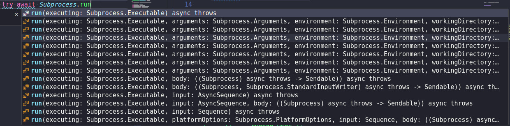
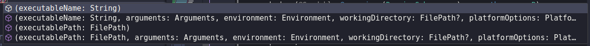
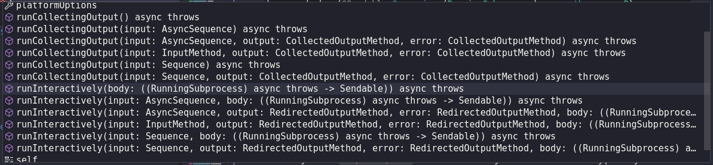

(This post is quite long, you may want to read it [on Github](https://github.com/LiarPrincess/Swift-forum-rants/tree/main/Subprocess).)

I don't use Swift Concurrency in day-to-day work and I'm not exactly familiar with `fork` internals (I always used wrappers), but for fun I wrote [Vampires and sunglasses](https://github.com/LiarPrincess/Vampires-and-sunglasses). This is basically the [Process from the old Foundation](https://developer.apple.com/documentation/foundation/process) upgraded to `async/await`. It is very similar to Python [asyncio.subprocess](https://docs.python.org/3/library/asyncio-subprocess.html). I will refer to some parts of the code later, so just a gist how it works:

```swift
let process = try Subprocess(
  executablePath: "/usr/bin/cat",
  arguments: ["Pride and Prejudice.txt"],
  stdout: .pipe
)

let s = try await process.stdout.readAll(encoding: .utf8)
print(s ?? "<decoding-failed>")

// In 1 expression:
let s2 = try await Subprocess(…).stdout.readAll(encoding: .utf8)
```

This will start the process, read the whole `stdout`, `waitpid` it (in the background) and then close the files. More interesting example would be:

```swift
let process = try Subprocess(executablePath: "/usr/bin/sleep", arguments: ["3"])

Task.detached {
  try await Task.sleep(nanoseconds: 1 * second)
  try await process.kill()
}

let status = try await process.wait()
assert(status == -9)
```

`wait` is just a synchronization point. Cancelling a `Task` that `waits` only cancels this `wait` and does nothing to the process. You can use `process.terminateAfter(body:)` if you need scoped lifetime  - this is exactly the same thing as `fileDescriptor.closeAfter(body:)`. More examples available [here](https://github.com/LiarPrincess/Vampires-and-sunglasses/blob/main/Sources/App/main.swift).

Now let's go back to the proposal.


## waitpid

The proposal does not exactly specify how `waitpid` happens, so the only thing that I have is the proof of concept:

```swift
extension Subprocess.Configuration {
  public func run<R>(…) async throws -> Result<R> {
    // (…)
    return try await withThrowingTaskGroup(of: RunState<R>.self) { group in
      @Sendable func cleanup() throws { /* Close files */ }

      group.addTask { waitpid(pid.value, &status, 0) }
      group.addTask {
        // Call the closure provided by the user. I removed uninteresting stuff.
        try await body()
        try cleanup()
      }

      while let state = try await group.next() {
        // Get the 'result' and 'terminationStatus'
      }
    }
  }
}
```

We have a blocking `waitpid` call on the cooperative thread. Tbh. even from the proof of concept I expected at least `waitpid(WNOHANG) + Task.sleep()` in a loop. I tried to start a few `ffmpeg` processes, and it didn't work.

Can the proposal at least mention that this is not how it will work in the real implementation?

I outlined a few solutions [here](https://github.com/LiarPrincess/Vampires-and-sunglasses/blob/main/Sources/Lib/Linux.swift#L262) with a link to CPython implementation.

## IO - Chatty children

Imagine this scenario:
1. Child process starts with `stdout` set to pipe
2. Child writes to `stdout`
3. Child writes some more…
4. Deadlock

How? Pipes are backed by a buffer, if nobody reads the buffer then `write` will wait until somebody does. This will deadlock with the `waitpid` and no reader.

The proposal does not mention this situation.

Though if we take the code from the proof of concept at the face value then as soon as the `body` finishes we will `close` the reading end of the pipe. This will `SIGPIPE` or `EPIPE` in the child. Well… you can't deadlock if you crash it first. Is that intended?

A more "human" approach would be to read all of the *nonsense* that the child writes and then `waitpid`. Or do it in parallel: 1 `Task` reads and the 2nd waits.

Python documentation explicitly warns about this situation for [`wait`](https://docs.python.org/3/library/asyncio-subprocess.html#asyncio.subprocess.Process.wait), that's why they recommend [`communicate`](https://docs.python.org/3/library/asyncio-subprocess.html#asyncio.subprocess.Process.communicate) for pipes.

Examples using the code from my repository (you can easily translate it to Python with `Popen`):

- 🔴 deadlock - pipe is full and the child is blocked
  ```swift
  let process = try Subprocess(
    executablePath: "/usr/bin/cat",
    arguments: ["Pride and Prejudice.txt"],
    stdout: .pipe,
  )

  let status = try await process.wait() // Deadlock
  ```

- 🟢 works - we read the whole `stdout` before waiting
  ```swift
  let process = try Subprocess( /* cat "Pride and Prejudice.txt" */ )
  let s = try await process.stdout.readAll(encoding: .utf8)
  let status = try await process.wait()
  ```

- 🟢 works - it reads `stdout/stderr` in parallel, so we do not deadlock on any of them
  ```swift
  let process = try Subprocess( /* cat "Pride and Prejudice.txt" */ )
  let status = try await process.readAllFromPipesAndWait() // 'communicate' in Python
  ```

## IO - Pipe buffer size

On Linux you can use `fcntl` with following arguments:
- `F_GETPIPE_SZ` - get pipe buffer size
- `F_SETPIPE_SZ` - set pipe buffer size; conditions apply

It may not be portable.

On my machine (Ubuntu 22.04.4 LTS) the default is `65536`. This is a lot, but still not enough to store the whole "Pride and Prejudice". You can just `cat` the whole thing for testing.

In theory we could allow users to specify the size of the buffer. I do not know the use case for this, and I'm not sure if anybody will ever complain if we don't. Long time ago I discovered that the more advanced features you use, the more things break. Anyway, if we want this then remember to ignore `EBUSY`.

I played with pipes [here](https://github.com/LiarPrincess/Vampires-and-sunglasses/blob/main/Sources/App/Tests/pipes.swift) to discover how they work, so you may want to check this out. Linux only.

## IO - Blocking

In "IO - Chatty children" I promised that it will not deadlock. I lied.

Tbh. I do not understand everything in `AsyncBytes`, but:

```swift
buffer.readFunction = { (buf) in
  // …
  let bufPtr = UnsafeMutableRawBufferPointer(start: buf.nextPointer, count: capacity)
  let readSize: Int = try await IOActor().read(from: file, into: bufPtr)
}

final actor IOActor {
  func read(from fd: Int32, into buffer: UnsafeMutableRawBufferPointer) async throws -> Int {
    while true {
      let amount = Darwin.read(fd, buffer.baseAddress, buffer.count)
      // …
    }
  }

  func read(from fileDescriptor: FileDescriptor, into buffer: UnsafeMutableRawBufferPointer) async throws -> Int {
    // this is not incredibly effecient but it is the best we have
    let readLength = try fileDescriptor.read(into: buffer)
    return readLength
  }
}
```

I'm not exactly sure what `try await IOActor().read(from: file, into: bufPtr)` does. It does not matter, I will just skip it.

Anyway, we have `fileDescriptor.read` and `Darwin.read` on cooperative threads. This method blocks. So currently we have:
- Task1 does `waitpid`
- Task2 waits for `read`

But when we `read` something it will unblock. Surely it will not deadlock. Right?

Right? 😭…

Right? 😭… 😭…

…

- Task1 does `waitpid`
- Task2 waits for `read`
- Process writes to `stderr`, fills the buffer and waits for somebody to read it

We are down 2 cooperative threads and we have a deadlock with the child process. *Ouch…*

Is there some prevention method for this? The proposal does not mention it. In the code we have "this is not incredibly effecient but it is the best we have" comment, but I do not know what it means.

A lot of people say that you should not block on the cooperative thread. I don't agree. I think you are *perfectly* fine with blocking (within reason…), and I would take it any day over *over-engineered* solution that does not work.

That said if we really wanted to *over-engineer* this:

- **Option A: Threads** - spin a thread for every `read`, then resume the `Continuation`. On cancellation (which we have to support!) just kill the thread.

  This is actually [how `waitpid` works](https://github.com/LiarPrincess/Vampires-and-sunglasses/blob/main/Sources/Lib/Linux.swift#L262) in my library. You start a process, I create a `waitpid` thread. Once the child terminates it [sends the message to `Subprocess` actor](https://github.com/LiarPrincess/Vampires-and-sunglasses/blob/main/Sources/Lib/Subprocess.swift#L317) which closes the files and resumes `wait` continuations (btw. they support cancellation, this is not as trivial as one may think).

  Threads are expensive, but in theory you can just have 1 thread for all IO and just `poll` the files. You can even monitor termination with Linux pid file descriptors, which gives us 1 thread for all of the `Subprocess` needs.

- **Option B: Non blocking IO** - this is what I do for IO. For files you open them with `O_NONBLOCK`, for pipes you set it later (btw. there is race condition in there).

  Reads from an empty pipe return `EWOULDBLOCK/EAGAIN`. In my implementation I just return `nil` as `readByteCount`, so that the user knows that nothing happened.

  If they really need to `read` something then they can use poor-person synchronization and do `Task.sleep`. Tbh. this is [exactly what I do](https://github.com/LiarPrincess/Vampires-and-sunglasses/blob/main/Sources/Lib/Subprocess%2BIO.swift#L207) when user calls `readAll`. Is this the best thing ever? Not. But it does not block. It is cooperative. And it supports cancellation.

  Blocking writes also return `EWOULDBLOCK/EAGAIN`, but it is a little bit more trickier, so read the POSIX docs. Writes `n > PIPE_BUF` may drop user data. This is what the spec says, but it also list the solution:
  - we can implement it on our side, but this is OS specific; on Linux you just split in `PIPE_BUF` chunks
  - or just go with Jaws/TopGear logic and let the users create a bigger pipe
  - or just mention `O_NONBLOCK` in documentation, and let the users deal with it

At this point we arrive to (unsurprising) conclusion: `Subprocess` should be 100% Swift concurrency neutral: it does not block and it respects cancellation. The library that I wrote archives this in following ways:
- `waitpid` is done in a separate thread:
  - when the process finishes naturally -> OS notifies the `waitpid` thread
  - `SIGKILL` -> our code sends signal -> child terminates -> OS notifies the `waitpid` thread
- all IO is done with `O_NONBLOCK`

## IO - `posix_spawn_file_actions_adddup2`

With this everything should… Not yet! We have an infinite loop!

```swift
public struct CollectedOutputMethod: Sendable, Hashable {
  // Collect the output as Data with the default 16kb limit
  public static var collect: Self
  // Collect the output as Data with modified limit
  public static func collect(limit limit: Int) -> Self
}
```

Why do I have to provide a limit (implicit 16kb or explicit)? I just want all! Is `Int.max` good for this? How about `Int.min`? `-1`? Tough luck: all of the will crash with SIGILL: illegal instruction operand.

Btw. what it the unit for `limit`? The proposal says: "By default, this limit is 16kb (when specifying `.collect`).". But in code we have `return .init(method: .collected(128 * 1024))`. Instead it should be `limitInBytes` or `byteCount`.

Anyway, you are miss-using the api. This works:

```swift
let (readEnd, writeEnd) = try FileDescriptor.pipe()
let buffer = UnsafeMutableRawBufferPointer.allocate(byteCount: 10, alignment: 1)
try writeEnd.close()

// When 'read' returns 0 it means end of the file.
while try readEnd.read(into: buffer) != 0 {
  // Code here never executes!
}
```

This is an infinite loop:

```swift
let (readEnd, writeEnd) = try FileDescriptor.pipe()
let buffer = UnsafeMutableRawBufferPointer.allocate(byteCount: 10, alignment: 1)
let writeEnd2 = dup(writeEnd.rawValue) // <-- I added this
try writeEnd.close()

while try readEnd.read(into: buffer) != 0 {
  // Infinite loop.
}
```

You are doing the 2nd one. With `posix_spawn_file_actions_adddup2` you send the file to the child, but you also have it in the parent process. The rule is: as long as there is `writeEnd` open then the `read` will never return `0`.

This combined with blocking reads means that our cooperative thread is down. But surely when the process exists it will unlock the thread? No. The `writeEnd` is closed after the `body` ends and we are inside the `body`. This is why everything should be `async`: still an infinite loop, but at least it is cooperative.

Anyway, you are supposed to close the child ends in the parent process. This is how in my implementation I can:

```swift
let s2 = try await Subprocess( /* cat "Pride and Prejudice.txt" */ ).stdout.readAll(encoding: .utf8)
```

It will read all, without any limits. We could allow users specify some limit, but it should be an option, not a mandatory api limitation.


## IO - Default values

In proposal we have:

```swift
public static func run<R>(
  …,
  input: InputMethod = .noInput,
  output: RedirectedOutputMethod = .redirect, // <-- here
  error: RedirectedOutputMethod = .discard,
  _ body: (@Sendable @escaping (Subprocess) async throws -> R)
) async throws -> Result<R>
```

`redirect` will create pipe. If the user forgets to read it (or they are not interested) we may deadlock when pipe buffer becomes full. Isn't `discard` a better **default** value?

```swift
let example1 = try await Subprocess.run(
  executing: .named("ls")
) { … }

let example2 = try await Subprocess.run(
  executing: .named("ls"),
  output: .redirect
) { … }
```

In `example2` you can clearly see that something is happening. The framework did not decide this for us. It was our own decision, and it is very visible to the readers.

Btw. `discard` writes to `/dev/null`. As far as I know you can get away with only 1 discard file with `O_RDWR`. This way you use less resources. May matter on servers.

## AsyncBytes - Optional output props

```swift
public struct Subprocess: Sendable {
  public var standardOutput: AsyncBytes?
  public var standardError: AsyncBytes?
}
```

Those properties are only usable if we specified `.redirect`. Why does the positive path require optional unwrap with `!`?

```swift
try await Subprocess.run(
  executing: .named("ls"),
  output: .redirect
) { process in
  process.standardOutput!.<something>
}
```

This `!` is not needed. `AsyncBytes` should store `FileDescriptor?` and throw `EBADF` (or `precondition`) if we try to use it when the argument was not `.redirect`.


## AsyncBytes - Read buffer

```swift
public struct AsyncBytes: AsyncSequence, Sendable {
  public typealias Element = UInt8
  public typealias AsyncIterator = Iterator

  public func makeAsyncIterator() -> Iterator
}
```

The only thing we have here is `AsyncIterator`. What if I wanted to write a `StringOutput` type that deals with all of the `String` stuff in a Java style decorator fashion:

```swift
let stdout = StringOutput(process.standardOutput!, encoding: .utf8)

for await line in stdout.lines() {
  …
}
```

I'm sure everybody knows how `StringOutput` internals would look like.

Why do I need to read byte-by-byte? Can't I just read the whole buffer of data? This just forces me to write the code that undoes what `AsyncBytes` did. It applies an abstraction (including its own buffering) that I have not asked for. And now we need 2 buffers: `AsyncBytes` one and the one where I gather my `String`.


## StandardInputWriter - Call `finish`?

For `StandardInputWriter` proposal states:

> **Note**: Developers must call `finish()` when they have completed writing to signal that the standard input file descriptor should be closed.

Why?

We are basically racing the process against the user code (`body` argument).
- process finishes 1st - reading end of the pipe is closed -> `SIGPIPE/EPIPE`, but this has nothing to do with closing the file
- user code (`body`) finishes 1st - can't we close it after? If the process is still running then it will get values from the buffer, and eventually `read(…) == 0`

I guess in theory we could have a subprocess that reads from the `stdin` in a loop, so if we do not close the pipe it will loop forever. But for this use case we require **all** of the users to call `finish()`?

Why is it called `finish` instead of `close`?

Why can't the `Subprocess` own the input? Is there any situation where the input outlives the `Subprocess`?

We could [make it idempotent](https://github.com/LiarPrincess/Vampires-and-sunglasses/blob/main/Sources/Lib/Subprocess%2BIO.swift#L30) where the 1st close would set the `FileDescriptor` to `nil` (to prevent double-closing). Then the `Subprocess` would call `close` again, just in case the user forgot. This will make `finish/close` optional for the users. They can, but they do not have to.

I do not like APIs based on the "user has to remember to do X". At least back in the `RxSwift` times we had `DisposableBag` and forgetting about it was a compiler warning. Here we get nothing.

## StandardInputWriter - Sendable args?

```swift
public struct StandardInputWriter: Sendable {

  private let actor: StandardInputWriterActor

  @discardableResult
  public func write<S>(_ sequence: S) async throws -> Int where S : Sequence, S.Element == UInt8

  @discardableResult
  public func write<S: AsyncSequence>(_ asyncSequence: S) async throws -> Int where S.Element == UInt8
}
```

Those `Sequences` will go to the `actor`. Shouldn't they be `Sendable`? I get concurrency warning for `try await Array(asyncSequence)`.

I think that any green-field project should [enable `StrictConcurrency` by default](https://github.com/LiarPrincess/Vampires-and-sunglasses/blob/main/Package.swift#L34). People may say something about false-positives, or that this feature is not yet ready. For me it caches bugs. And it creates the right mental model of how things work, so that we do not have to "unlearn" later.

## IO - StandardInputWriter - `write` names

Bike-shedding: on `FileDescriptor` methods that take `Sequence` are called `writeAll`. On `StandardInputWriter` (which is a wrapper around a `FileDescriptor`) we have `write`.

Do we want more consistent naming?

## IO - File ownership for `close`

@beaumont wrote:

> Because .readFrom(_:) and .writeTo(_:) both take FileDescriptor I tab-completed my way into a footgun, by passing .standardInput, .standardOutput, and .standardOutput to input, output, and error respectively. This of course was silly for me to do, because they got closed after the process exited.

I was thinking about the same thing! But it may be a little bit more complicated:
- single `shouldCloseFiles` switch - as soon as you set it to `false` you have to close ALL of the files by yourself. Obviously, it is really easy to forget to do so.
- separate `shouldClose` per file - you have to remember which files you have to close, and closing them twice may be an error. So does forgetting it. I went this way in my implementation.

The real semantic that we are trying to express is: `move = close`, `borrow = do nothing`. If we ignore all of the `enums` and the overload explosion we would have:

```swift
func run(…, stdout: borrowing File, …) async throws -> CollectedResult
func run(…, closingStdout: consuming File, …) async throws -> CollectedResult
```

The `consuming` version would call the `borrowing` one and then close the file. Obviously `deinit` would not call `close`. It is the other way around: `consuming func close()` will end lifetime and `deinit` does nothing .

If we go back to reality (column wise):

|InputMethod            |CollectedOutMethod |RedirectedOutputMethod|
|-----------------------|-------------------|----------------------|
|noInput                |discard            |discard               |
|readingFrom `borrowing`|writeTo `borrowing`|writeTo `borrowing`   |
|readingFrom `consuming`|writeTo `consuming`|writeTo `consuming`   |
|                       |collect            |redirect              |
|                       |collect(limit:)    |                      |

A lot of the overloads! And we can't use `enum` because we can't store `borrowing`. We can't use protocols, because move-only do not support them. But we can:

```swift
// For a second let's assume that FileDescriptor is move-only.

struct CollectedOutputMethod: ~Copyable {
  private enum Storage: ~Copyable, Sendable {
    case consuming(FileDescriptor)
    case borrowing(FileDescriptor)
  }

  static func writeAndClose(_ f: consuming FileDescriptor) -> CollectedOutputMethod {
    return CollectedOutputMethod(raw: .consuming(f))
  }

  static func write(_ f: borrowing FileDescriptor) -> CollectedOutputMethod {
    // We can't copy a FileDescriptor, but we can copy its properties.
    // It works as long as we do not try to close it.
    let copy = FileDescriptor(<copy properties>)
    return CollectedOutputMethod(raw: .borrowing(copy))
  }
}
```

Some people may not like it because we are (de-facto) copying the move-only object. I think it is all about the semantic of move-only, not about *being* move-only. And the semantic is: call `close` to `consume`. In the `borrowing` branch we will never call `close`. It is kind of like in move-only smart pointers we can copy the pointer, but the contract says that we should also increment `refCount`. Copy is allowed it is all about the semantic.

Obviously this is not possible because `FileDescriptor` is not move-only as we have to be compatible with the old Foundation. This was a theoretical exercise, but maybe somebody has some solution.


## IO - Closing error

I already mentioned it a few weeks ago, but to have everything in 1 place:

Currently even if the process terminated successfully (regardless of the status), but the closing threw an exception then:
- the parent process (aka. our code) will only get the file closing exception - even if the state of the world (for example database) has changed.
- other files will not be closed.

There is a possible double closing issue.

## Signals - `ESRCH`

Should signals throw on `ESRCH`? In my implementation:

```swift
/// - Returns: `true` if the signal was delivered. `false` if the process
/// was already terminated.
@discardableResult
public func sendSignal(_ signal: Signal) throws -> Bool
```

Most of the time you send `SIGKILL/SIGTERM`. If the process is already terminated they do nothing. I'm not sure if this is an error that we need to `throw`. If you really need this information then you can check the `Bool` return.

Also, this is a race condition. You think that the process is running, you send `SIGTERM`, but in the meantime the process has terminated. Is this a reason `throw`?

## Signals - Duplicate `pid`

I'm not exactly sure if I'm correct, but I think that after the process has terminated its `pid` is available for reuse. Same thing as `FileDescriptors`, but IIRC files guarantee the lowest value from the table, and pids do not.

So in theory:
1. We start a process with closure `body` argument
2. Process terminates
3. `body` still runs
4. OS reuses pid
5. `body` sends `SIGTERM`

Is this possible? Idk.

In my implementation after the `waitpid` thread finishes I set the `actor Subprocess` state to `terminated(exitStatus: CInt)`. From now on all of the `sendSignal` calls will do nothing and return `false` (meaning that process was terminated).

## Arguments - `ExpressibleByStringLiteral`

Proposal v2 has:

> Ideally, the `Arguments` feature should automatically split a string, such as "-a -n 1024 -v 'abc'", into an array of arguments. This enhancement would enable `Arguments` to conform to `ExpressibleByStringLiteral`, (…).

The `split` may fail if the `String` is malformed, and from what I see [`init(stringLiteral:)`](https://developer.apple.com/documentation/swift/expressiblebystringliteral/init(stringliteral:)) does not allow failures.

## Arguments - QOL

Minor QOL stuff:
- `public init(_ array: [String], executablePathOverride: String)` - can `executablePathOverride` be made optional? In the most common usage this parameter will not be supplied. Is this the same as @beaumont asked?

- `Arguments(CommandLine.arguments.dropFirst())` - do we want this? Obviously user can `Array(…)`.

## Environment - `init`

I assume that there is no `public` initializer for `Environment()` because that would be ambiguous between:
- empty collection - Swift convention; for example `Array<Int>()` means empty.
- `inherit` - which is what users really mean.

Maybe `custom` could be renamed to `empty`, this word already exists in Swift: `Array.isEmpty`.

## Environment - `strlen` bug

Just in case it slips through a code review later: `Subprocess.Configuration` -> `spawn` -> `createEnvironmentAndLookUpPath` -> `createFullCString`:

```swift
let rawByteKey: UnsafeMutablePointer<CChar> = keyContainer.createRawBytes()
(…)
let totalLength = keyContainer.count + 1 + valueContainer.count + 1
```

For `String`:
- `createRawBytes` does `strdup(string)`
- `keyContainer.count` returns `string.count`

Try this:

```swift
let s = "Łoś" // Polish word for moose
print(s.count) // 3 - number of grapheme clusters
print(strlen(strdup(s)!)) // 5 - number of bytes
```

Fun fact: my real-world name contains "ł". If create a directory using it (which 99% of users do) and put as a value in env then `totalLength` is incorrect as it treats `1 Character = 1 byte` while "ł" is `2 bytes`.

## Ergonomic & documentation

Though, by far my biggest gripe with the proposal is (btw. we are 25k characters in):
- we have 6 overloads with 8 or 9 arguments each.
- all of the overloads start with the same arguments making it hard to see the difference
- some of the arguments are optional which basically mean more overloads.

This makes the code completion for `Subprocess.run(` useless.

Also, the documentation would be very long - around 50% of the proposal. We would require people to spend 20min on reading before they can use the API. Then they would use it and come back to the documentation to re-read it because there is no "progressive disclosure". There is just 1 method with multiple overloads.

Also, we have to attach (almost) the same documentation to each `run` overload. And given that most of the stuff is the same (prolog and everything from `Executable` up to `PlatformOptions` arguments) it will be hard for users to differentiate between different overloads.

To solve this we would put the documentation on the `Subprocess` type, but still it will be ~50% of the proposal with multiple paragraphs. You can't create link to a paragraph to help somebody on Stack Overflow.

Also, API is different from other systems/languages. You can't just google "linux kill process" because most of this is not applicable to the model presented in the proposal.

I like the [old Foundation Process docs](https://developer.apple.com/documentation/foundation/process). They are way too short, but when I want to read about something I just click it in the left side-bar.

---

That's theory, in practice:



Q1: Which overload should we choose if we want to run `git status`?

```swift
let result = try await Subprocess.run(executing: .at("ls"))
```

Q2: Which `run` overload will this call? Will this open pipes for communication? Will this allocate buffer to collect output?

---

Answer 1: None of them. You have to copy an example from the documentation. Maybe if you are familiar with the API you just select randomly and remove all of the arguments you do not need. This is a bit of a made up scenario, because new users will never type `Subprocess.run(` they will try the initializer `Subprocess(` first, and then go to docs without trying anything else.

Answer 2: No closure -> this is `CollectedResult` call with `.noInput`. It will allocate buffers, so if this is not what you want then you just wasted some memory. Btw. there is a bug in the question that I asked: it should be `.named("ls")`. I think `.atPath("ls")` would make it easier to spot. Though it is still weird to read:

  ```swift
  // Executing what? The subject is missing.
  Subprocess.run(executing: .named("ls"))
  // Proper sentence, but nobody is going to write it this way.
  // In Poland we say: butter is butterish.
  // It means: padding to make an essay longer just to pass length requirement.
  Subprocess.run(executing: Executable.named("ls"))
  // Different label.
  Subprocess.run(executable: .named("ls"))
  ```

## Ergonomic & documentation - Overhaul

TLDR; Rename `Subprocess.Configuration` to `Subprocess` and move `run` methods there.

```swift
public struct Subprocess2 {

  public let executable: Executable
  public var arguments: Arguments
  public var environment: Environment
  public var workingDirectory: FilePath?
  public var platformOptions: PlatformOptions

  /// PATH lookup.
  public init(
    executableName: String,
    arguments: Arguments = Arguments(),
    environment: Environment = .inherit,
    workingDirectory: FilePath? = nil,
    platformOptions: PlatformOptions = .default
  )

  /// Absolute/relative path.
  public init(executablePath: FilePath, …)
}
```

In summary:
- we have an initializer - which is what users expect
- this step is pretty small - you mostly have to choose between `executableName` and `executablePath`
- documentation is pretty short (but obviously longer than here) - only the difference between `executableName` and `executablePath` is highlighted. Mention that the other arguments are just setters. There is no `input/output/CollectedResult` etc., which makes learning more "bite-sized".

Code completion is:



For running we have the same 6 overloads:

```swift
public struct Subprocess2 {

  public func runCollectingOutput(
    input: InputMethod = .noInput,
    output: CollectedOutputMethod = .collect,
    error: CollectedOutputMethod = .collect
  ) async throws -> CollectedResult { … }

  // I renamed 'Subprocess' to 'RunningSubprocess' in 'body'.
  // The result is now 'InteractiveResult'.
  public func runInteractively<R>(
    input: InputMethod = .noInput,
    output: RedirectedOutputMethod = .redirect,
    error: RedirectedOutputMethod = .discard,
    _ body: (@Sendable @escaping (RunningSubprocess) async throws -> R)
  ) async throws -> InteractiveResult<R> { … }

  // +overloads for different 'input'
}
```

The user flow is:
1. They need to `run/start/fork` - they will probably look for a method. They may have seen it while setting the properties.
2. Now they have to choose between `runCollectingOutput` and `runInteractively`.

    

    Before they even open the documentation they can see that:
    - all methods have some `input` argument
    - `Collecting` methods have `CollectedOutputMethod`
    - `Interactive` methods have `body: (RunningSubprocess -> R)`

    I guess the closure with `RunningSubprocess` is the difference, and that's why it is "interactive". The documentation is also shorter and focuses on the difference between `CollectingOutput` and `Interactive` not on `Executable/Arguments/Environment`.

3. Then they choose one of the overloads - you can clearly see that the difference is the `input`: `InputMethod/Sequence/AsyncSequence`.

In theory you could call the `runCollectingOutput/runInteractively` multiple times. Idk. if this is a feature we want/need.

## `SystemPackage.Errno`

Swift system [has a really nice `Errno` type](https://github.com/apple/swift-system/blob/main/Sources/System/Errno.swift):

```swift
do {
  let byteCount = try fd.read(into: buffer)
} catch Errno.wouldBlock, Errno.resourceTemporarilyUnavailable {
}

// Or:

internal func system_kill(pid: pid_t, signal: CInt) -> Errno? {
  let result = kill(pid, signal)
  if result == -1 { return .current }
  return nil
}
```

They did a really good job, and I like it. I makes everything so much nicer to read/write. I also like their convention of `system_` prefix for syscalls.

## CustomStringConvertible

`"\(Pid): \(executable) \(args trimmed to 20 characters)"`

Or maybe the same as `ps a` -> `COMMAND` column.

## Process outliving its parent

@jaredh159 (Jared Henderson) wrote:
> Just wanted to quick chime in that the behavior of a spawned process outliving it's parent (and being reparented by the OS) is sometimes exactly what you want…

For my implementation I was thinking about adding `Bool` flag to disable termination tracking (`waitpid` thread). You can still do this: just start a process and never `wait` it. This ends parent and orphans the child.

I didn’t, because it is rather niche use case. Most of the time you want to spawn a daemon. This is platform specific. In practice I would just use one of the C templates that eventually calls Swift. So, at least for daemons, I think it is a non-issue. Do you have some other use case?

Not sure where the proposal stands on this. AFAIK old foundation can do this, but I have not tested it.

## Overall proposal evaluation

Needs work.


