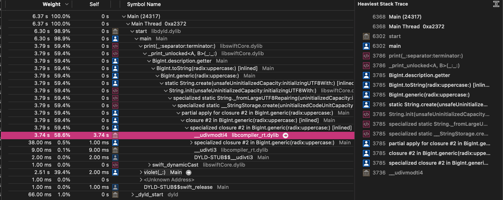

# String + print


(Btw. have you noticed something about the Numberick and Violet results?)

When it comes to the implementation: the simplest case is when the radix is a power of 2. In such situation we can use the linear algorithm where we treat the whole `BigInt` as a bit buffer and group those bits according to radix. For radix is 16 we group by 4 bits etc. The tiny edge case is when the radix bit count is not a multiply of the digit size. For example:
- digit is 64bit
- radix is 8 -> group 3 bits together
- 64/3=21, the remaining bit has to be grouped with bits from the next digit

With this Violet is [3210x faster than Swift Numerics](https://github.com/apple/swift-numerics/pull/256#issuecomment-1416165556) for radix 16:


Following implementations have linear power of 2 algorithms (link goes to the implementation):
- [Violet](https://github.com/LiarPrincess/Violet-BigInt-XsProMax/blob/main/Sources/BigInt%2BToString.swift#L102) - you need to use the `BigInt` overload: `String(_ value: BigInt, radix: Int = 10, uppercase: Bool = false)`
- [v8](https://github.com/v8/v8/blob/main/src/bigint/tostring.cc#L242)
- [GMP](https://gmplib.org/repo/gmp/file/ca451d583385/mpn/generic/get_str.c#l381)

---

But this is not our case, because we print in radix 10 which is not a power of 2. Side-note: printing `BigInt` is not that common. It is mostly used for debug, but even then it is not like humans can read 100 digits. Most of the time `BigInts` are there "in the background" and we never `print` them.

Anyway, Node beats GMP in some cases. Links to implementation:
- [Node](https://github.com/v8/v8/blob/main/src/bigint/tostring.cc)
- GMP - [`mpz_out_str`](https://gmplib.org/repo/gmp/file/tip/mpz/out_str.c) calls [mpn_get_str](https://gmplib.org/repo/gmp/file/ca451d583385/mpn/generic/get_str.c#l365)

I will use Node as the base of explanation.

First of all they have [template <digit_t radix> DivideByMagic(RWDigits rest, Digits input, char* output)](https://github.com/v8/v8/blob/main/src/bigint/tostring.cc#L79). Division is important for printing and unfortunately is is very expensive. In Violet 59% of the whole fibonacci  program is spend in division intrinsic:



One of the ways to make division cheaper is to divide by a constant. This way the compiler can reduce the division into something that gives the same result but is much cheaper, for example [modular multiplicative inverse](https://en.wikipedia.org/wiki/Modular_multiplicative_inverse). This is what `DivideByMagic` does.

If you want to see this in action then: some time ago I had to write an algorithm to count the trailing zeros in `Int64`. This can be done via binary search by dividing by powers of 10. Unfortunately divisions are expensive. But if you [unroll the whole algorithm](https://github.com/LiarPrincess/Oh-my-decimal/blob/mr-darcy/Sources/Decimal/Helpers/Globals.swift#L89) and use constants then no division will be performed. You can paste this code in [godbolt.org](https://godbolt.org/) to check.

---

This definitely makes things faster, but the actual difference is the algorithm.

Classic algorithm (used by Attaswift, Numberick, Violet) performs `n` steps where each step does `quotientAndRemainder` to extract rightmost digit. Obviously a "digit" is a whole `UInt64` not a decimal digit. Example implementation [here](https://github.com/LiarPrincess/Violet-BigInt-XsProMax/blob/main/Sources/BigInt%2BToString.swift#L298). In total we have:
- `n` steps
- each steps performs up to `n` divisions with `UInt/UInt` operands

The optimized algorithm (used by Node and GMP) is divide and conquer. Node has a fantastic documentation [here](https://github.com/v8/v8/blob/main/src/bigint/tostring.cc#L275). Basically you take the whole `BigInt` and split it in half by dividing by a big enough power of `radix`. And then you work on those halfs.

[quote="wadetregaskis, post:64, topic:71583"]
Ah yes, [its implementation ](https://github.com/attaswift/BigInt/blob/ef1641b9ec4de6ba48b899816448a9b19f307df2/Sources/String%20Conversion.swift#L121) is short & relatively readable but not efficient¹. Lots of temporaries, which means copying, which seems to be the biggest performance-killer in this sort of thing.
[/quote]

There are multiple reasons. I believe that once you reach a certain size divide and conquer is the biggest factor.

[quote="wadetregaskis, post:64, topic:71583"]
@oscbyspro [wrote ](https://github.com/apple/swift-foundation/commit/845652a1273188fe2830142ddbf0f2a8a2c0905b) [a pretty good version ](https://github.com/apple/swift-foundation/blob/main/Sources/FoundationEssentials/Formatting/BinaryInteger%2BNumericStringRepresentation.swift) for decimal conversion, that's part of the new new Foundation. If you're curious about some of the optimisation details check out [the pull request ](https://github.com/apple/swift-foundation/pull/306) (and if you're tangentially curious about the functional-correctness aspects, check out [my initial version ](https://github.com/apple/swift-foundation/pull/262) - it's harder than you might think to implement this sort of thing even before you start to worry about performance).
[/quote]

I think (but I have not looked carefully) that this is the classic algorithm mentioned above. The only difference is that Attaswift uses a temporary `parts: [String]`.

Violet/Numberick also use the same algorithm, and even without those allocations they are 100x slower than divide and conquer.

[quote="wadetregaskis, post:73, topic:71583"]
Using `current.description` instead of string interpolation (`"\(current)"`) surprisingly made no measurable difference.
[/quote]

I don't know what Swift does, but in Python:

```py
ma = "ma"
print(f"ala {ma} kota")
```

Gives us following bytecode:

```
0           0 RESUME                   0

2           2 LOAD_CONST               0 ('ma')
            4 STORE_NAME               0 (ma)

3           6 PUSH_NULL
            8 LOAD_NAME                 1 (print)
            10 LOAD_CONST               1 ('ala ')  # Put 'ala ' on stack
            12 LOAD_NAME                0 (ma)      # Put variable 'ma' on stack
            14 FORMAT_VALUE             0           # Convert variable 'ma' to string
            16 LOAD_CONST               2 (' kota') # Put ' kota' on stack
            18 BUILD_STRING             3           # Concatenate 3 values from the stack
            20 CALL                     1           # Call 'print'
            28 POP_TOP
            30 RETURN_CONST             3 (None)
```

At the same time:

```py
ma = "ma"
print(f"{ma}")
```

Gives us:

```
0           0 RESUME                   0

2           2 LOAD_CONST               0 ('ma')
            4 STORE_NAME               0 (ma)

3           6 PUSH_NULL
            8 LOAD_NAME                 1 (print)
            10 LOAD_NAME                0 (ma)    # Put variable 'ma' on stack
            12 FORMAT_VALUE             0         # Convert variable 'ma' to string
            14 CALL                     1
            22 POP_TOP
            24 RETURN_CONST             1 (None)
```

Even Python optimizes this, so the above code will not copy the `string`.


[quote="wadetregaskis, post:73, topic:71583"]
The swap optimisation I suggested earlier did nothing to start with, because it turns out [`BigInt` implements `+=` as just `+` and then an assignment ](https://github.com/attaswift/BigInt/blob/ef1641b9ec4de6ba48b899816448a9b19f307df2/Sources/Addition.swift#L122), which surprisingly the compiler takes on face value and doesn't optimise.
[/quote]

Compiler cannot assume that `+=` and `+` are related. It may optimize things in the most simplest cases, but not with logic as complicated as `BigInt`. The whole `BigInt` has to be designed to support efficient `+=`.
