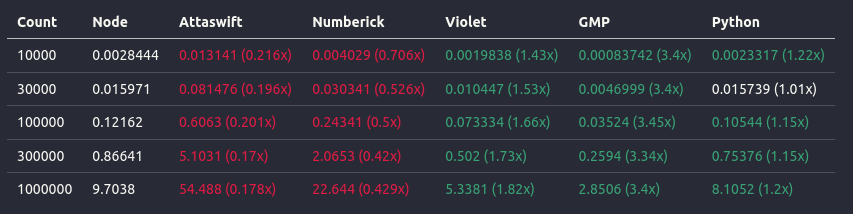
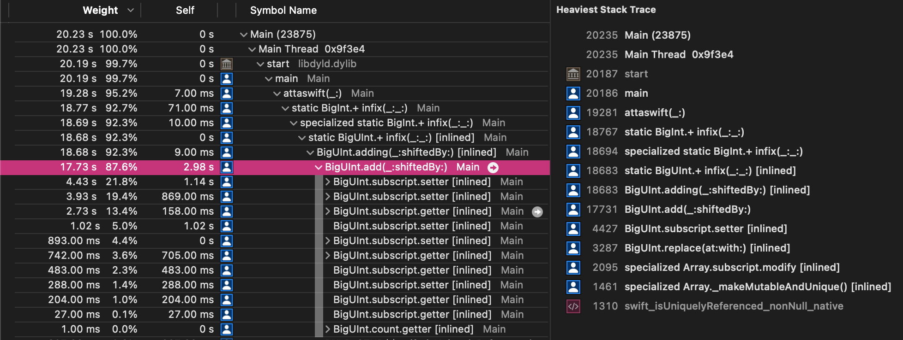
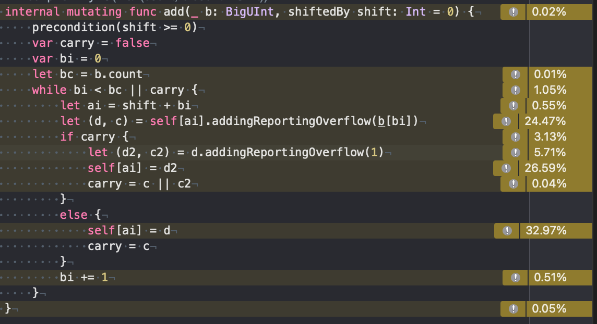
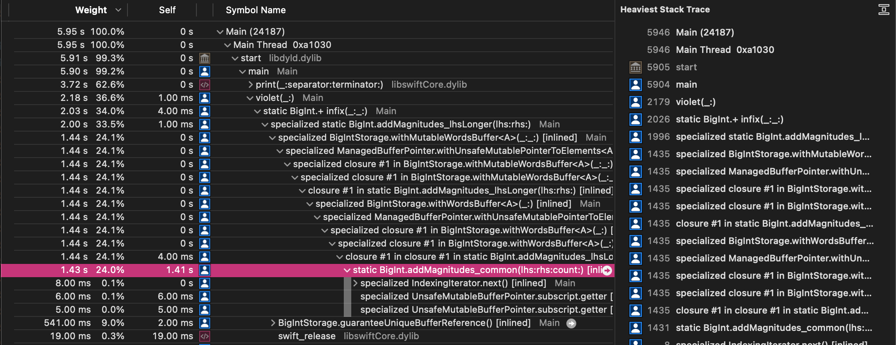
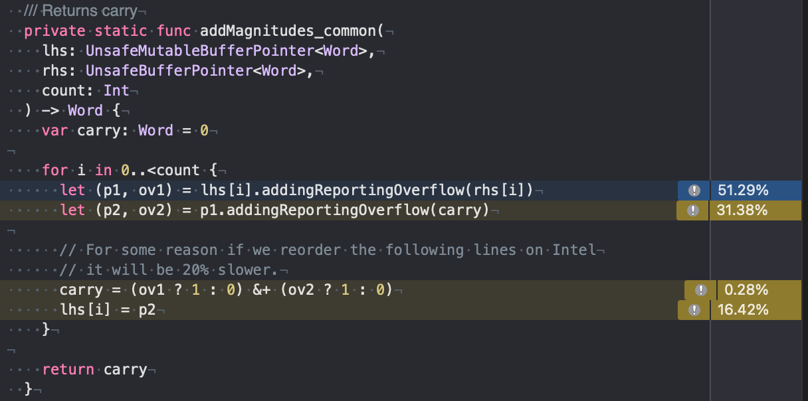
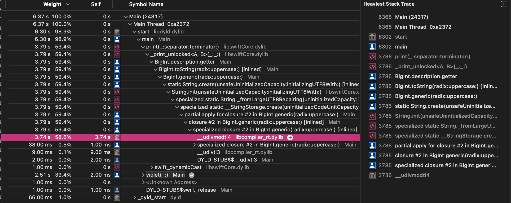
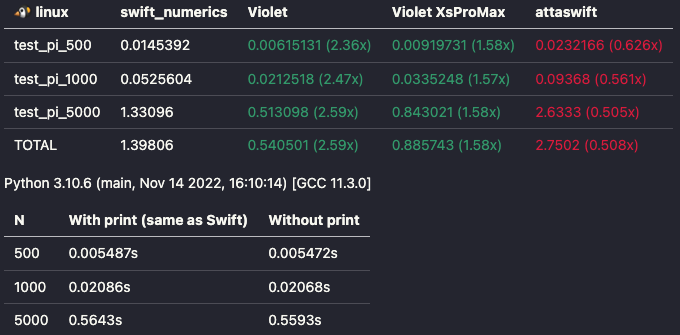

Quick list of the previous `BigInt` posts:
- [42](https://forums.swift.org/t/standard-vapor-website-drops-1-5-of-requests-even-at-concurrency-of-100/71583/42) by @lorentey
- [43](https://forums.swift.org/t/standard-vapor-website-drops-1-5-of-requests-even-at-concurrency-of-100/71583/43) by @scanon
- [46](https://forums.swift.org/t/standard-vapor-website-drops-1-5-of-requests-even-at-concurrency-of-100/71583/46) by @lorentey - performance benchmarks
- [64](https://forums.swift.org/t/standard-vapor-website-drops-1-5-of-requests-even-at-concurrency-of-100/71583/64) by @wadetregaskis
- [73](https://forums.swift.org/t/standard-vapor-website-drops-1-5-of-requests-even-at-concurrency-of-100/71583/73) by @wadetregaskis - [Numberick](https://github.com/oscbyspro/Numberick/tree/main)
- [82](https://forums.swift.org/t/standard-vapor-website-drops-1-5-of-requests-even-at-concurrency-of-100/71583/82) by @tera


# Fibonacci

[quote="lorentey, post:46, topic:71583"]
Node.js's BigInteger.+ beats attaswift.BigInt.+ by about 3x for the specific case that's being exercised here (n = 10,000), which is precisely within expectations for a naive implementation.
[/quote]


We may as well add some actually optimized libraries, to check how much performance we leave on the table.



Methodology:
- Ubuntu on Intel Pentium G4560. Numbers suggest that @lorentey machine is ~1.6x faster.
- @axello/@lorentey code. Full [repository here](TODO:). Not optimal: no numeric tricks, tons of allocations (no `inout`) etc. Intended, as this is what users will write.
- Node (2nd column) is used as a base -> values in parenthesis mean relative improvement over Node. For example GMP 1000000 is 3.4x faster than Node.
- each test was repeated 50 times. Value in the cell is average after removing min/max.
- Violet does not provide a Swift package, to solve this the source code of all of the Swift implementations (Attaswift, Numberick, Violet) was copied inside the test package.
- maximum relative standard deviation for the last row is 3.31% (for Python). Other implementations are <1.5%. Results are deemed stable and repeatable.

Lets check if the results are similar to @lorentey by comparing the Attaswift/Node ratio (last column in their data):

| Count   | @lorentey | Table above |
| ------- | --------- |-|
| 10000   | 2.78x     | 0.013141 / 0.0028444 = 4.619954999 |
| 30000   | 3.76x     | 0.081476 / 0.015971 = 5.101496462 |
| 100000  | 5.02x     | 0.6063 / 0.12162 = 4.985199803 |
| 300000  | 5.52x     | 5.1031 / 0.86641 = 5.889936635 |
| 1000000 | 5.78x     | 54.488 / 9.7038 = 5.61511985 |

I would say that they are comparable especially above the 100000, where their results reach 5.02x.

---

**Node** sits right in the middle. Their implementation calls [AddSigned](https://github.com/v8/v8/blob/main/src/bigint/vector-arithmetic.cc#L93) which then goes to [Add](https://github.com/v8/v8/blob/main/src/bigint/vector-arithmetic.cc#L41). This is our reference point.

**Python** is faster than Node:
- Python 3.12 compiled on the machine that ran those tests; Python 3.13 was just released with JIT compiler, it should not matter.
- [implementation](https://github.com/python/cpython/blob/main/Objects/longobject.c#L3617) is fairly simple.
- digits are [stored as flexible array member](https://github.com/python/cpython/blob/main/Include/cpython/longintrepr.h#L95) after the `PyObject_HEAD` (in older Python versions they actually used `PyObject_VAR_HEAD`, things changed during [january 2023 re-work](https://github.com/python/cpython/issues/101291)). The whole [`int` object is just 1 allocation](https://github.com/python/cpython/blob/main/Objects/longobject.c#L157) (no pointer chasing).
- they [store 30 bits per digit](https://github.com/python/cpython/blob/main/Include/cpython/longintrepr.h#L42) in `uint32_t` (`PYLONG_BITS_IN_DIGIT == 30` is the default).
- negligible overhead from the interpreter and method dispatch (via [numeric `nb_add`](https://github.com/python/cpython/blob/main/Objects/longobject.c#L6503), not the full operator resolution).
- reference counting for garbage collection as `int` can't have cycles.

Looking at the Python code one could ask: why Node is so slow? They should easily beat Python. Well… IDK. Perf tools give us nothing (I assume that they count `BigInt` as `Shared libraries -> node`):

```
 [Summary]:
   ticks  total  nonlib   name
    295    0.1%    7.9%  JavaScript
   3416    1.0%   92.1%  C++
  22975    6.8%  619.1%  GC
  333291   98.9%          Shared libraries

 [Shared libraries]:
   ticks  total  nonlib   name
  330151   98.0%         <PATH_REDACTED>/node/v19.0.0/bin/node
   2982    0.9%          /usr/lib/x86_64-linux-gnu/libc.so.6
    116    0.0%          [vdso]
     42    0.0%          /usr/lib/x86_64-linux-gnu/libstdc++.so.6.0.30
```

The JavaScript part does not matter (0.1%). In logs we see that `fib_loop` was not optimized by Maglev/TurboFan, which means that we ran on the bytecode. Just like in Python only the inner C/C++ implementation matters.  Anyway, both Node and Python do not use assembly, so a good Swift implementation should at least match their results.

[**GMP**](https://gmplib.org/) obviously wins:
1. `mpz_add` is defined in [aors.h](https://gmplib.org/repo/gmp/file/tip/mpz/aors.h#l50) imported with `OPERATION_add`.
2. When signs are the same it calls `mpn_add` which is basically [__GMPN_AORS](https://gmplib.org/repo/gmp/file/tip/gmp-h.in#l1927) with `FUNCTION` being `__gmpn_add_n`: `__gmpn_add_n(__gmp_wp, __gmp_xp, __gmp_yp, __gmp_i)` (`w` is result, `xy` are operands and `i` is min length).
3. `mpn_add_n` [is implemented in assembly](https://gmplib.org/repo/gmp/file/tip/mpn/x86_64/aors_n.asm):
   - 4 digits are handled in a single iteration
   - `L(lt4)` - less than 4 - deal with the trailing 1/2/3 digits
   - `L(2)` - deal with the trailing 2/3 digits
   - `L(3)` - deal with the trailing 3 digits
   - `L(top)/L(mid)/L(end)` - loop

Just for completeness my GMP configuration is:
- Version: GNU MP 6.3.0
- Host type: kabylakenoavx-pc-linux-gnu (AVX does not matter)
- ABI: 64
- Compiler: gcc (Ubuntu 11.4.0-1ubuntu1~22.04) 11.4.0
- [tuneup](https://gmplib.org/manual/Performance-optimization) was not used, with the fallback to [Skylake configuration](https://gmplib.org/repo/gmp/file/tip/mpn/x86_64/skylake/gmp-mparam.h) (Kaby Lake and Skylake are similar)
- mini-gmp was not tested


Btw. there is a theoretical "nails" representation where we leave the highest bits of every digit/word `0` (similar to Python) and use vector operations. Fairly interesting, but c'mon, we can't expect github libraries written by unpaid volunteers to do this kind of stuff.

[**Swift Numerics** -> biginteger branch](https://github.com/apple/swift-numerics/tree/biginteger) was not tested as there is a high probability that [their result would not be correct](https://github.com/apple/swift-numerics/issues/242). It is [~10% faster than Attaswift and much slower than Violet](https://github.com/apple/swift-numerics/pull/256#issuecomment-1416165556), which makes me believe that we would not get any new information.

[**Numberick**](https://github.com/oscbyspro/Numberick) by @oscbyspro:
- this seems to be a new kid on the block, so I do not know much about them.
- `UIntXL` is `BigUInt`. I don't know if `BigInt` is available. We are only dealing with positive numbers, so sign overhead should be negligible anyway.
- their stack traces are so long that my Instruments broke. I just could't see the inner loop, so I don't know what is happening inside.


**Violet** is an implementation written by me. It is written against the same machine that produced the results above. This may explain why it is so fast. The implementation used is [Violet-BigInt-XsProMax](https://github.com/LiarPrincess/Violet-BigInt-XsProMax), not the [Violet](https://github.com/LiarPrincess/Violet) one. Differences:

- Violet - under the hood it is a union (via tagged pointer) of `Int32` (called `Smi`, after V8) and a heap allocation (magnitude + sign representation) with ARC for garbage collection. This means no heap allocations in `Int32` range, but it assumes 64 bit pointers. More information in the [documentation](https://github.com/LiarPrincess/Violet/blob/main/Documentation/BigInt.md).

- Violet-BigInt-XsProMax - no `Smi`, only heap. [Slightly faster](https://github.com/apple/swift-numerics/pull/256#issuecomment-1416165556) than Violet, because it does not have to check which representation we are dealing with.

The `Int32` stuff do not matter in this test, so I went with `Violet-BigInt-XsProMax` (Apple naming scheme, don't blame me). I will talk more about this a bit later in this post.


[**Attaswift**](https://github.com/attaswift/BigInt) - this is the original `BigInt` (the one used by OP), so lets focus on this. Their layout boils down to:

```swift
// https://github.com/attaswift/BigInt
// LICENSE: https://github.com/attaswift/BigInt/blob/master/LICENSE.md
struct BigInt: SignedInteger {
  var magnitude: BigUInt
  var sign: Sign
}

struct BigUInt: UnsignedInteger {
  typealias Word = UInt

  enum Kind {
    case inline(Word, Word)
    case slice(from: Int, to: Int)
    case array
  }

  var kind: Kind // Internal for testing only
  var storage: [Word] // Internal for testing only; stored separately to prevent COW copies

  subscript(_ index: Int) -> Word {
    get {
      // @LiarPrincess: Simplified for readability
      switch kind {
      case .inline: …
      case .slice: …
      case .array: …
      }
    }
    set(word) { … }
  }
}
```

If we run `fibonacci(500000)` and `print` the result, their inner loop for addition will take 87.6%:





Those subscripts are heavy! The same thing in Violet would spend 62.6% in `print` and 36.6% for `fibonacci(500000)`:





[quote="scanon, post:43, topic:71583"]
`BigInt.+` isn't particularly bad, but it isn't particularly clever either. GMP and similar implementations have hand-unrolled assembly loops for these core operations, which can easily be a two-to-three times faster than compiler-generated code (in any language--carry propagation introduces a second loop-carried dependency, and compilers don't generally do well with converting CF into a physical register to test the loop criterion and then back into a flag).
[/quote]


It is a little bit pointless to talk about the code generated by Attaswift, but Violet gives us:

```py
.LBB1_6:
mov     r9, qword ptr [rdx + 8*rcx]
mov     r10, qword ptr [rdi + 8*rcx]
mov     r11, qword ptr [rdi + 8*rcx + 8]
lea     rbx, [r10 + r9]
xor     r14d, r14d
add     rax, rbx # Carry from the previous iteration
setb    r14b
mov     qword ptr [rdi + 8*rcx], rax # lhs[i] = …
mov     rax, qword ptr [rdx + 8*rcx + 8]
lea     rbx, [r11 + rax]
add     r10, r9
adc     r14, rbx
setb    r9b
add     r11, rax
movzx   eax, r9b
adc     rax, 0   # Carry for the next iteration
mov     qword ptr [rdi + 8*rcx + 8], r14 # lhs[i+1] = …
add     rcx, 2   # Increment index
cmp     rsi, rcx # Loop condition
jne     .LBB1_6
```

It handles 2 digits per iteration. Remember the "reorder lines -> 20% slower" comment in the Violet code above? This is exactly this. If you paste this code in [godbolt.org](https://godbolt.org/) and reorder those lines you will see that `add rcx, 2` became `inc rsi` and only a single digit was handled during a single iteration. Calculation itself is done by `lea` followed by `add; setb` or `add; adc rax, 0` for carry, how much it matters depends on the CPU.

At the same time `GMP` calculates 4 digits in a single iteration with 4x `adc` one after the other. I can't paste the code here because of the license, but  [here is the link](https://gmplib.org/repo/gmp/file/tip/mpn/x86_64/aors_n.asm#l142).

That said, focusing on addition is a little bit pointless, as `mul/div` are the real heavy hitters in most of the workloads, and even a few `adds` will not out-weight a single `mul`. Attaswift vs Violet [in mul/div](https://github.com/apple/swift-numerics/pull/256#issuecomment-1416165556):


That said, even if Attaswift used a simple `Array`/`ContiguousArray` is would still have some problems. For example `isUniquelyReferenced` (or whatever `Array` does) check can be merged with `append/reserveCapacity` for `carry`. This could potentially save us a copy.

Also, setting an index in an `Array` does another `isUniquelyReferenced` check which the complier will not move out of the loop. In Violet COW is done before we even enter the hot functions. There is a system where calling `storage.guaranteeUniqueBufferReference` (with the optional `capacity` argument) gives us a `token` which is required to call a mutating operation. This way the compiler forces us to do COW checks. This `token` should be move-only, but this code was written before we had them in Swift (`borrow` = mutation, `consume` = storage reallocation + new `token` is issued).

Also, as already pointed out in this thread, `BigInt` operations should strive to be `inout` to avoid buffer allocations. The whole `BigInt` has to be written with this in mind.


|Count|Node|Attaswift|Attaswift_inout|Numberick|Numberick_inout|Violet|Violet_inout|
|-----|----|---------|---------------|---------|---------------|------|------------|
|   10000|0.0028444|<span style="color:#df1c44">0.013141 (0.216x)</span>|<span style="color:#df1c44">0.0099377 (0.286x)</span>|<span style="color:#df1c44">0.004029 (0.706x)</span>|0.0028562 (0.996x)|<span style="color:#39a275">0.0019838 (1.43x)</span>|<span style="color:#39a275">0.00091961 (3.09x)</span>
|   30000|0.015971|<span style="color:#df1c44">0.081476 (0.196x)</span>|<span style="color:#df1c44">0.067276 (0.237x)</span>|<span style="color:#df1c44">0.030341 (0.526x)</span>|<span style="color:#df1c44">0.022008 (0.726x)</span>|<span style="color:#39a275">0.010447 (1.53x)</span>|<span style="color:#39a275">0.0049653 (3.22x)</span>
|  100000|0.12162|<span style="color:#df1c44">0.6063 (0.201x)</span>|<span style="color:#df1c44">0.59103 (0.206x)</span>|<span style="color:#df1c44">0.24341 (0.5x)</span>|<span style="color:#df1c44">0.21888 (0.556x)</span>|<span style="color:#39a275">0.073334 (1.66x)</span>|<span style="color:#39a275">0.046469 (2.62x)</span>
|  300000|0.86641|<span style="color:#df1c44">5.1031 (0.17x)</span>|<span style="color:#df1c44">5.3454 (0.162x)</span>|<span style="color:#df1c44">2.0653 (0.42x)</span>|<span style="color:#df1c44">1.9327 (0.448x)</span>|<span style="color:#39a275">0.502 (1.73x)</span>|<span style="color:#39a275">0.37492 (2.31x)</span>
| 1000000|9.7038|<span style="color:#df1c44">54.488 (0.178x)</span>|<span style="color:#df1c44">59.466 (0.163x)</span>|<span style="color:#df1c44">22.644 (0.429x)</span>|<span style="color:#df1c44">21.479 (0.452x)</span>|<span style="color:#39a275">5.3381 (1.82x)</span>|<span style="color:#39a275">4.0418 (2.4x)</span>


This gives us:
- Attaswift - weird; smaller `counts` are faster, but bigger are slower. I have no idea. I expected no changes, though the variance is quite big on the smaller sets, so that may be it.
- Numberick - ~5% improvement in 2 last rows.
- Violet - ~30% improvement in 2 last rows. The whole implementation was written with `inout` in mind. The original code (the 1st table in this post) was using the library incorrectly. It is unfortunate that `BigInt` has `Int` in its name, because people will assume that they are as "cheap" as any other `Int`.


GMP also allows you to alias the `lhs`/`result` pointers, but remember that if you are using the inner `mpn` functions then the ranges should not overlap. Or just use the safe `mpz`.

Moral of the story: use `inout` for `BigInt`, even if the library does not optimize this (yet…).


Btw. there is a tiny gotcha in the `inout` method if you have `enum` based storage like Attaswift has: `BigUInt.Kind: inline | slice | array`, as `switch` can increase the reference count making `inout` always work on `+2` which will force COW. Violet has the same problem with the `smi|heap` representation (`Smi` is an inlined `Int32` instead of the pointer). To solve it [I temporary assign `Int32.zero`](https://github.com/LiarPrincess/Violet/blob/main/Sources/BigInt/BigInt.swift#L758):

```swift
public static func += (lhs: inout BigInt, rhs: BigInt) {
  // lhs is on +1
  switch (lhs.value, rhs.value) {
  case let (.smi(lhsSmi), .smi(rhs)): …
  case (.smi(let lhsSmi), .heap(var rhs)): …

  case (.heap(var lhsHeap), .smi(let rhs)):
    // lhs is +2
    Self.releaseBufferToPreventCOW(&lhs)
    // lhs is +1
    …

  case (.heap(var lhsHeap), .heap(let rhs)):
    // lhs is +2
    Self.releaseBufferToPreventCOW(&lhs)
    // lhs is +1
    …
  }
}

private static func releaseBufferToPreventCOW(_ int: inout BigInt) {
  let zero = Smi(Smi.Storage.zero)
  int.value = .smi(zero)
}
```

[quote="tera, post:82, topic:71583"]
It's not so bad but not quite as good as node.js implementation timing indicated above. In my implementation I've manually unrolled the loop, effectively working with "8x64" bit ints in the outermost loop. Possible reasons for this implementation being slower compared to node.js implementation:

1. they might be using `asm`.
2. they could be using 128-bit ints, while my implementation is using 64-bit ints as the base type.
3. they could be using SIMD tricks.
4. there's some ARC traffic in there in my implementation.
5. the obvious difference could be just due to the differences in the computer specs (I'm on a 2021 MacBook Pro, which is M1 Pro @ 3GHz if I am not mistaken).
[/quote]

(Disclaimer: I changed bullet points to numbers in their post, for easier reference).

1. No, but GMP does
2. [No](https://github.com/v8/v8/blob/main/src/bigint/bigint.h#L34)
3. No SIMD
4. Check assembly, Swift compiler will usually leave unique check inside the loop. Violet has an [over-engineered solution](https://github.com/LiarPrincess/Violet-BigInt-XsProMax/blob/main/Sources/BigIntStorage.swift) which gives you control over this.

# String + print


(Btw. have you noticed something about the Numberick and Violet results?)

When it comes to the implementation: the simplest case is when the radix is a power of 2. In such situation we can use the linear algorithm where we treat the whole `BigInt` as a bit buffer and group those bits according to radix. For radix is 16 we group by 4 bits etc. The tiny edge case is when the radix bit count is not a multiply of the digit size. For example:
- digit is 64bit
- radix is 8 -> group 3 bits together
- 64/3=21, the remaining bit has to be grouped with bits from the next digit

With this Violet is [3210x faster than Swift Numerics](https://github.com/apple/swift-numerics/pull/256#issuecomment-1416165556) for radix 16:


Following implementations have linear power of 2 algorithms (link goes to the implementation):
- [Violet](https://github.com/LiarPrincess/Violet-BigInt-XsProMax/blob/main/Sources/BigInt%2BToString.swift#L102) - you need to use the `BigInt` overload: `String(_ value: BigInt, radix: Int = 10, uppercase: Bool = false)`
- [v8](https://github.com/v8/v8/blob/main/src/bigint/tostring.cc#L242)
- [GMP](https://gmplib.org/repo/gmp/file/ca451d583385/mpn/generic/get_str.c#l381)

---

But this is not our case, because we print in radix 10 which is not a power of 2. Side-note: printing `BigInt` is not that common. It is mostly used for debug, but even then it is not like humans can read 100 digits. Most of the time `BigInts` are there "in the background" and we never `print` them.

Anyway, Node beats GMP in some cases. Links to implementation:
- [Node](https://github.com/v8/v8/blob/main/src/bigint/tostring.cc)
- GMP - [`mpz_out_str`](https://gmplib.org/repo/gmp/file/tip/mpz/out_str.c) calls [mpn_get_str](https://gmplib.org/repo/gmp/file/ca451d583385/mpn/generic/get_str.c#l365)

I will use Node as the base of explanation.

First of all they have [template <digit_t radix> DivideByMagic(RWDigits rest, Digits input, char* output)](https://github.com/v8/v8/blob/main/src/bigint/tostring.cc#L79). Division is important for printing and unfortunately is is very expensive. In Violet 59% of the whole fibonacci  program is spend in division intrinsic:



One of the ways to make division cheaper is to divide by a constant. This way the compiler can reduce the division into something that gives the same result but is much cheaper, for example [modular multiplicative inverse](https://en.wikipedia.org/wiki/Modular_multiplicative_inverse). This is what `DivideByMagic` does.

If you want to see this in action then: some time ago I had to write an algorithm to count the trailing zeros in `Int64`. This can be done via binary search by dividing by powers of 10. Unfortunately divisions are expensive. But if you [unroll the whole algorithm](https://github.com/LiarPrincess/Oh-my-decimal/blob/mr-darcy/Sources/Decimal/Helpers/Globals.swift#L89) and use constants then no division will be performed. You can paste this code in [godbolt.org](https://godbolt.org/) to check.

---

This definitely makes things faster, but the actual difference is the algorithm.

Classic algorithm (used by Attaswift, Numberick, Violet) performs `n` steps where each step does `quotientAndRemainder` to extract rightmost digit. Obviously a "digit" is a whole `UInt64` not a decimal digit. Example implementation [here](https://github.com/LiarPrincess/Violet-BigInt-XsProMax/blob/main/Sources/BigInt%2BToString.swift#L298). In total we have:
- `n` steps
- each steps performs up to `n` divisions with `UInt/UInt` operands

The optimized algorithm (used by Node and GMP) is divide and conquer. Node has a fantastic documentation [here](https://github.com/v8/v8/blob/main/src/bigint/tostring.cc#L275). Basically you take the whole `BigInt` and split it in half by dividing by a big enough power of `radix`. And then you work on those halfs.

[quote="wadetregaskis, post:64, topic:71583"]
Ah yes, [its implementation ](https://github.com/attaswift/BigInt/blob/ef1641b9ec4de6ba48b899816448a9b19f307df2/Sources/String%20Conversion.swift#L121) is short & relatively readable but not efficient¹. Lots of temporaries, which means copying, which seems to be the biggest performance-killer in this sort of thing.
[/quote]

There are multiple reasons. I believe that once you reach a certain size divide and conquer is the biggest factor.

[quote="wadetregaskis, post:64, topic:71583"]
@oscbyspro [wrote ](https://github.com/apple/swift-foundation/commit/845652a1273188fe2830142ddbf0f2a8a2c0905b) [a pretty good version ](https://github.com/apple/swift-foundation/blob/main/Sources/FoundationEssentials/Formatting/BinaryInteger%2BNumericStringRepresentation.swift) for decimal conversion, that's part of the new new Foundation. If you're curious about some of the optimisation details check out [the pull request ](https://github.com/apple/swift-foundation/pull/306) (and if you're tangentially curious about the functional-correctness aspects, check out [my initial version ](https://github.com/apple/swift-foundation/pull/262) - it's harder than you might think to implement this sort of thing even before you start to worry about performance).
[/quote]

I think (but I have not looked carefully) that this is the classic algorithm mentioned above. The only difference is that Attaswift uses a temporary `parts: [String]`.

Violet/Numberick also use the same algorithm, and even without those allocations they are 100x slower than divide and conquer.

[quote="wadetregaskis, post:73, topic:71583"]
Using `current.description` instead of string interpolation (`"\(current)"`) surprisingly made no measurable difference.
[/quote]

I don't know what Swift does, but in Python:

```py
ma = "ma"
print(f"ala {ma} kota")
```

Gives us following bytecode:

```
0           0 RESUME                   0

2           2 LOAD_CONST               0 ('ma')
            4 STORE_NAME               0 (ma)

3           6 PUSH_NULL
            8 LOAD_NAME                 1 (print)
            10 LOAD_CONST               1 ('ala ')  # Put 'ala ' on stack
            12 LOAD_NAME                0 (ma)      # Put variable 'ma' on stack
            14 FORMAT_VALUE             0           # Convert variable 'ma' to string
            16 LOAD_CONST               2 (' kota') # Put ' kota' on stack
            18 BUILD_STRING             3           # Concatenate 3 values from the stack
            20 CALL                     1           # Call 'print'
            28 POP_TOP
            30 RETURN_CONST             3 (None)
```

At the same time:

```py
ma = "ma"
print(f"{ma}")
```

Gives us:

```
0           0 RESUME                   0

2           2 LOAD_CONST               0 ('ma')
            4 STORE_NAME               0 (ma)

3           6 PUSH_NULL
            8 LOAD_NAME                 1 (print)
            10 LOAD_NAME                0 (ma)    # Put variable 'ma' on stack
            12 FORMAT_VALUE             0         # Convert variable 'ma' to string
            14 CALL                     1
            22 POP_TOP
            24 RETURN_CONST             1 (None)
```

Even Python optimizes this, so the above code will not copy the `string`.


[quote="wadetregaskis, post:73, topic:71583"]
The swap optimisation I suggested earlier did nothing to start with, because it turns out [`BigInt` implements `+=` as just `+` and then an assignment ](https://github.com/attaswift/BigInt/blob/ef1641b9ec4de6ba48b899816448a9b19f307df2/Sources/Addition.swift#L122), which surprisingly the compiler takes on face value and doesn't optimise.
[/quote]

Compiler cannot assume that `+=` and `+` are related. It may optimize things in the most simplest cases, but not with logic as complicated as `BigInt`. The whole `BigInt` has to be designed to support efficient `+=`.

# What to use? (spoiler: GMP)

Ok, let's say that we have to choose some `BigInt` library. Which one?

First of all there is no "one `BigInt` library to rule them all". It all depends. As already said Violet has 2 versions:

- [Violet](https://github.com/LiarPrincess/Violet) - inlined `Int32` or a heap allocation.
- [Violet-BigInt-XsProMax](https://github.com/LiarPrincess/Violet-BigInt-XsProMax) - only heap.

In most of the tests "Violet-BigInt-XsProMax" [is slightly faster](https://github.com/apple/swift-numerics/pull/256#issuecomment-1416165556) because it does not have to check with which representation we are dealing with. But in [swift-numerics/pull/120](https://github.com/apple/swift-numerics/pull/120) @xwu proposed a π calculation test.



In this test "Violet" is much faster than "Violet-BigInt-XsProMax", getting similar results as much more optimized Python (the numbers that we are dealing with are huge, and Violet naive `div` is slow). The reason is the input distribution for multiplication. For example for `test_pi_5000` (row/column is operand length, value is operation count; full distribution for all operations is [available here](https://github.com/LiarPrincess/Swift-BigInt-performance-tests/blob/pi-input-distribution/result.md)):

|lhs/rhs|0|
|-|-|
|0|8067|
|200|6795|
|400|6470|
|600|6234|
|800|6069|
|and so on…||

The `rhs` is always a single `Word`, most probably in `Int32` range. This is exactly the case that Violet was optimized for because it does not have to allocate memory.

Bottom line is: know your number distribution.

- BigInt
  - Assumes that most of the code will use built-in Swift integer types. `BigInt` will be used, but only in places that can overflow.
  - Focuses on performance for big numbers, since small ones will be handled using Swift types.
  - Is more of a auxiliary type, than a thing on its own.
- Unlimited/general purpose integer (I made-up this name, so don't Google it):
  - Assumes that this is the only integer type available in the system.
  - Will probably optimise for small numbers (think: 0, 1, 256 etc.) rather than big ones (think: 123_123_123_123_123_123).

Fibonacci is `BigInt`, but if we were implementing a math library and wanted to give our users a nice `Int` type then "general purpose integer" could be better. Interestingly Python `int` type is unlimited - there is no `BigInt` library because the default `int` is a `BigInt`.


As far as currently available Swift libraries go:

- 🔴 [Swift numerics/biginteger](https://github.com/apple/swift-numerics/tree/biginteger) - [please don't](https://github.com/apple/swift-numerics/issues/242)

- 🟡 [Numberick](https://github.com/oscbyspro/Numberick) by @oscbyspro
  - I don't know anything about their implementation
  - they only have `BigUInt`? I wanted to run Violet tests on it and they require `BigInt`
  - for `mul` they use Karatsuba [above 20 words](https://github.com/oscbyspro/Numberick/blob/main/Sources/NBKCoreKit/Private/NBKStrictUnsignedInteger%2BMultiplication.swift#L32) - this is around the expected value (usually between 20 and 40 depending on the implementation details). Attaswift [limit is 1024](https://github.com/attaswift/BigInt/blob/master/Sources/Multiplication.swift#L84), which is uncommon.

- 🟢 Attaswift
  - Violet tests were merged, but some of them were commented
  - [#115 bitWidth is wrong for -(power-of-two)](https://github.com/attaswift/BigInt/issues/115) by @wadetregaskis is related to [those commented tests](https://github.com/attaswift/BigInt/blob/master/Tests/BigIntTests/Violet/BigIntPropertyTests.swift#L60) from Violet
  - [#99 [Violet] Node tests](https://github.com/attaswift/BigInt/pull/99) says that `xor` may sometimes be incorrect (PR contains detailed description):

    ```swift
    // Attaswift returns '0'
    self.xorTest(lhs: "-1", rhs: "18446744073709551615", expecting: "-18446744073709551616")
    ```
  - [#99 [Violet] Node tests](https://github.com/attaswift/BigInt/pull/99) says that shift right uses different rounding than `Swift` (PR contains detailed description):

    ```swift
    // Attaswift returns '60397977'.
    self.shiftRightTest(value: "-1932735284", count: 5, expecting: "-60397978")
    ```

    Attaswift is slightly inconsistent with the rest of the Swift:

    |Engine|Result|
    |-|-|
    |attaswift/BigInt|-60397977|
    |[Wolfram Alpha](https://www.wolframalpha.com/input?i=-1932735284+%3E%3E+5)|-60397977|
    |Node v17.5.0|-60397978|
    |Python 3.7.4|-60397978|
    |Swift 5.3.2|-60397978|
    |Violet|-60397978|

    (Yes, all of the results in the table are correct.)

    I think that attaswift uses sign + magnitude representation. If it was 2 complement then everything would be trivial, but it is not, so sometimes you need an adjustment: Swift uses what would be `GMP_DIV_FLOOR` mode in `GMP`. Which means that if we are negative and any of the removed bits is `1` then we have to round down.


Anyway, if my goal was to use 100% Swift then I would go with Attaswift.

That said, I don't think anyone goal is to use 100% Swift, but to use the best possible implementation. Because of that I would recommend using `GMP` wrapped in a `class`. It is easily the fastest and the most battle-tested option out there. Just check if it is supported on your platform.

If you need `BigInt`, but you do not need a full `BigInt`, then you may look at the wider fixed width integers:
- stdlib will get `Int128/UI128` soon - I tried 4 or 5 builds (as recent as from 2 weeks ago), and all of them crashed
- `DoubleWidth` solutions, for example:
  - [swift-numerics](https://github.com/apple/swift-numerics/blob/main/Sources/_TestSupport/DoubleWidth.swift) - few months ago [I opened an issue](https://github.com/apple/swift-numerics/issues/272) about crashes and incorrect results. This uncovered even more issues (see the connected PR). And their test suite is lacking. Just be careful and write tests.
  - [Numberick](https://github.com/oscbyspro/Numberick) also has one. At some point I opened an issue there, but it was solved quite quickly.
- `DoubleWidth` may be slow as soon as you reach multiplication on `UInt256`, so it may be better to just [use `4x UInt64` and schedule 16 (independent!) multiplications one after the other](https://github.com/LiarPrincess/Oh-my-decimal/blob/mr-darcy/Sources/Decimal/Generated/UInt256.swift#L404).

A quick indicator of the quality is the `div` function, if you see any `>> 1` (which indicates bit-by-bit division) then run away.

Do not go too crazy with fixed width integers, `Int128/Int256` are fine, but above that YMMW. I have a Python script that will generate `UInt128` (as `2x UInt64`) and `UInt256` (as `4x UInt64`) for me. I never had to use anything bigger.

# Fin

With all that it is clear that the community should drop everything, cancel WWDC and start implementing a good `BigInt`.

Please don't.

At least I don't think this a good idea. I have never used `BigInt` in a business scenario, and a lot of the programs that use it are artificial Fibonacci-like benchmarks. There are some real-world use cases, but they can be solved with GMP.

[quote="taylorswift, post:44, topic:71583"]
i think the focus on BigInt in this thread is illustrative because in the past at a different company i recall experiencing similar difficulties with underdeveloped libraries and being blocked by things like [IEEE decimal support](https://en.wikipedia.org/wiki/Decimal128_floating-point_format) or [ION support](https://github.com/amazon-ion).
[/quote]

☝️⬆️🆙📤🔺👆 the decimal thingie.

Support for IEEE 754 decimal sucks across the board, not only in Swift.
- [Intel library](https://www.intel.com/content/www/us/en/developer/articles/tool/intel-decimal-floating-point-math-library.html) should work as long as you are on supported platform and can FFI to C
- C folks are [working on it](https://en.cppreference.com/w/c/compiler_support/23)
- (as you pointed out in another thread) Mongo supports it as `Decimal128` via `BID`.

Anyway, for my needs [I implemented it myself](https://github.com/LiarPrincess/Oh-my-decimal), and now I diligently ignore 70% of the library, because only `+-*/`, `truncatingRemainder` and `quantize` are useful.


